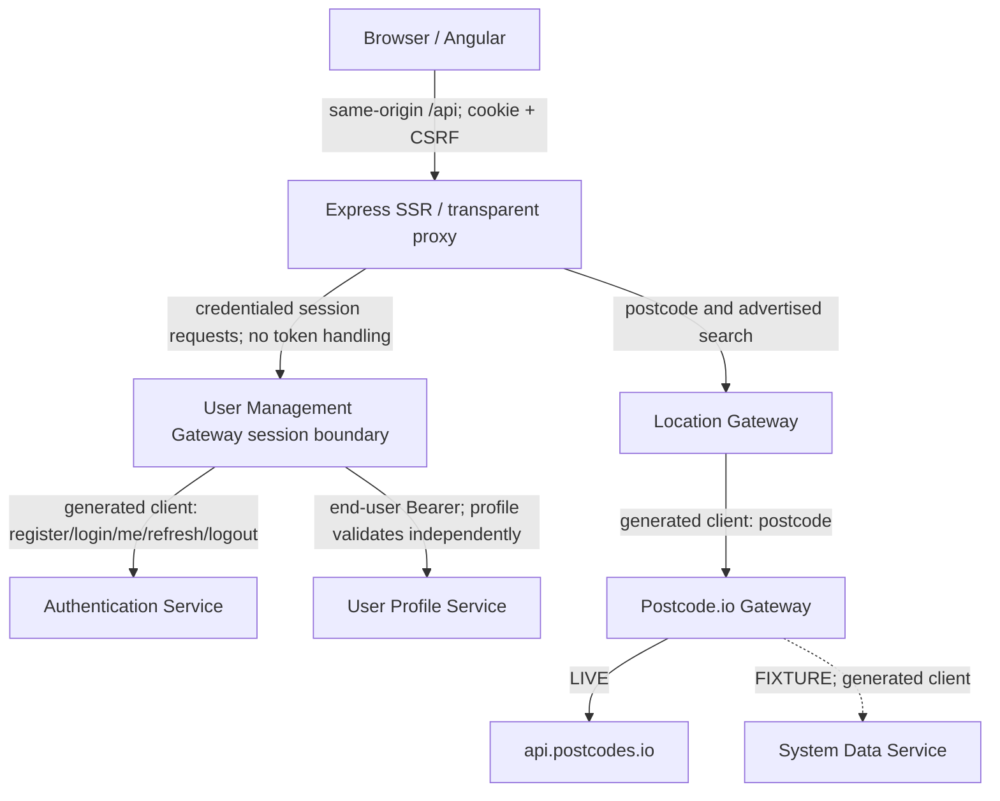

# User management path: beta-readiness workstream

Audit date: 18 July 2026; progress evidence updated 22 July 2026

Status: **Baseline prepared; not beta-ready.** No repository in this workstream
may be described as beta-ready until every item in the Definition of Done is
demonstrated and all Critical/High findings are closed or, where the Definition
permits, explicitly accepted.

## Scope

Fully audited:

- `job-seeker-copilot-client`
- `user-management-gateway`
- `authentication-service`
- `user-profile-service`
- `location-gateway`
- `postcode-io-gateway`
- build and contract tooling needed by this path

Not audited beyond transitive/build impact: job finding, documents, reporting,
payments, AI providers, landing-page application/backend, root infrastructure,
AWS/Amplify and production deployment.

## Verified architecture

Key corrections to the assumed diagram:

- Express SSR is a runtime same-origin proxy between Angular and both public
  gateways; it must not read, store or invent authentication tokens.
- Location is a separate client/BFF path; user-management-gateway does not call
  location-gateway.
- `system-data-service` is an unapproved compile/runtime transitive dependency
  of postcode fixture mode.
- Build-time generated clients form additional coupling edges.

## Build architecture

`build-tools` is **not required** by the selected path: none of the five Maven
services declares it as parent or dependency. No `build-tools` repository will
be created. The remaining workstream reproducibility blockers are local
`systemPath` JARs and generated TypeScript trees:

| Consumer | Missing clean-clone input |
|---|---|
| Client | Generated user-management, location and out-of-scope API sources/contracts |
| User-management gateway | Versioned authentication/profile consumer contracts; clients generate during the UMG-01 build |
| Location gateway | Postcode gateway client JAR |
| Postcode.io gateway | System-data-service client JAR |

Generated binary JARs are deliberately not committed.

## Current functionality

| Capability | State | Evidence/constraint |
|---|---|---|
| Registration | Partial | Auth account and profile are created synchronously; partial failure is not compensated. |
| Login | Present | BCrypt comparison; UMG converts the short-lived access/refresh pair to HttpOnly cookies and rate-limits auth paths. |
| Logout | Present | UMG revokes the authentication-service session and clears both cookies. |
| Token expiry | Present | Short-lived RS256 access tokens with validated issuer/audience/type. |
| Refresh/revocation | Present | Single-use rotation, replay response, logout revocation and bounded concurrent refresh coalescing. |
| Profile create/read/update | Present | UMG forwards the end-user bearer server-to-server; profile-service independently validates it and derives `sub`. |
| Password change/reset | Absent | Beta requirement/deferral must be decided. |
| Account deletion/export | Absent | Privacy/retention decision required. |
| Postcode lookup | Present | Full/outcode provider calls; error mapping/resilience incomplete. |
| Location name search | Broken/absent | Client calls `/api/locations`; service does not expose it. |
| Duplicate registration | Present | Authentication service returns conflict, with enumeration concerns. |
| Session expiration UX | Partial | Some 401 paths log out; no central guard/refresh/startup validation. |

## Baseline evidence

| Repository | Build/test baseline | Secret baseline | Status |
|---|---|---|---|
| Client | 28 tests and current-tree production build pass; lint fails (76 errors); clean build blocked; npm audit reports 4 High and 3 Low chains | No confirmed client credential; local caches/generated output excluded | Blocked |
| User-management gateway | UMG-01/03/04/05/06/08/09/10/11 repository controls are implemented; UMG-02/07 and final cross-service/browser evidence remain | No Gitleaks finding in legacy history | In remediation |
| Authentication service | AUTH-01 is merged; JWT signing configuration is local-only, required and tested with the compromised value removed | No active signing secret is tracked | In remediation |
| User-profile service | 22 tests pass | No legacy-history Gitleaks finding | Blocked |
| Location gateway | 4 tests pass only with local untracked client JAR | No legacy-history Gitleaks finding | Blocked |
| Postcode.io gateway | 3 tests pass only with local untracked client JAR | No legacy-history Gitleaks finding | Blocked |

Gitleaks 8.30.1 was run in a network-disabled, read-only, capability-free
container. Targeted checks supplement it for hard-coded JWT/provider secrets,
private keys, `.env`, personal email fixtures and generated/binary artefacts.
Reports never reproduce secret values.

The sanitised current trees and complete imported histories pass Gitleaks. Nine
authentication-history findings were individually reviewed as synthetic README
examples or a test fixture and suppressed only by exact commit/file/rule/line
fingerprints. The known public-root `.env` finding is not imported. Rotation of
any real credential or signing value that was deployed or reused remains
[AUTH-01](https://github.com/jobseekercopilot/authentication-service/issues/1).

Backend CI currently produces Maven dependency inventories but does not yet
provide a dependable vulnerability gate. This is recorded explicitly in each
backend backlog rather than treating `dependency:tree` as a security scan. The
first authentication OWASP scan reported 10 affected dependency records,
including 17 Critical and 38 High entries before triage, plus two feed-record
processing errors; [AUTH-11](https://github.com/jobseekercopilot/authentication-service/issues/11)
owns upgrade, reachability/false-positive review and a reliable CI gate.

## Critical and high findings

Critical/P0:

1. Other clean builds still depend on generated sources or untracked
   `systemPath` JARs; UMG-01 removes this dependency for user-management-gateway.
2. Authentication signing/public-history credentials require sanitisation and
   owner-controlled rotation.
3. ~~User-profile-service trusts a forgeable `X-User-Id` header.~~ PROFILE-01
   is merged; ownership now comes only from independently validated bearer `sub`.
4. Postcode fixture mode depends on unapproved `system-data-service` tooling.

High/P1 themes:

- browser adoption of the merged refresh/revocation/logout boundary and final
  cross-service negative/security evidence remain;
- partial registration remains; downstream calls now have bounded resilience;
- development databases/consoles and automatic schema update;
- missing location search, unstable error mapping and provider resilience;
- bearer token/profile PII in browser local storage;
- incomplete negative/security/contract/E2E tests;
- no beta dashboard/alerts, migration/restore or rollback evidence.

Repository-level evidence, exact files, acceptance criteria, dependencies and
effort are in each `docs/BETA_READINESS_AUDIT.md` and its matching GitHub issue.

## Definition of Done: controlled private beta

- [ ] All six repositories build from fresh private clones.
- [ ] CI passes on `develop`.
- [ ] No real secrets or generated build artefacts are tracked.
- [ ] No unresolved Critical or High security finding remains.
- [ ] Dependency scans contain no unaccepted Critical or High issue.
- [ ] Registration, authentication, profile and location flows work together.
- [ ] Negative and unauthorised scenarios are tested.
- [ ] Cross-user data access is prevented and tested.
- [ ] Production configuration is separate from local configuration.
- [ ] Database schemas and migrations are reproducible.
- [ ] External provider failures are handled safely.
- [ ] Logs contain no passwords, tokens or unnecessary personal data.
- [ ] Health and readiness checks exist.
- [ ] Minimum beta monitoring and alert requirements are documented.
- [ ] Every repository has accurate setup and operational documentation.
- [ ] The complete browser journey passes in automated integration/E2E.
- [ ] A clean-environment deployment and smoke test has succeeded.
- [ ] Remaining Medium and Low risks are documented and accepted.
- [ ] A rollback procedure is documented and exercised.
- [ ] The project has no open item marked `Beta blocker` for this workstream.

“Done” means ready for a controlled private beta. It does not guarantee the
absence of every defect or security risk.

## Recommended implementation order

1. `feature/reproducible-api-client-builds` — replace binary/generated local
   dependencies and make every clean clone compile.
2. Rotate credentials; implement JWT/session and service-identity boundaries.
3. Add production migrations/profile ownership and lifecycle/privacy controls.
4. Complete location validation, resilience, search decision and provider tests.
5. Add full browser E2E, accessibility, telemetry, alerts, deployment smoke and
   rollback runbook.

## Links

- [Private Job Seeker Copilot Project](https://github.com/users/jobseekercopilot/projects/1)
- [Parent epic: User management path ready for private beta](https://github.com/jobseekercopilot/user-management-gateway/issues/12)
- [Client audit backlog](https://github.com/jobseekercopilot/job-seeker-copilot-client/issues)
- [User-management gateway audit backlog](https://github.com/jobseekercopilot/user-management-gateway/issues)
- [Authentication audit backlog](https://github.com/jobseekercopilot/authentication-service/issues)
- [User-profile audit backlog](https://github.com/jobseekercopilot/user-profile-service/issues)
- [Location audit backlog](https://github.com/jobseekercopilot/location-gateway/issues)
- [Postcode.io audit backlog](https://github.com/jobseekercopilot/postcode-io-gateway/issues)

The epic has all 58 canonical findings attached as native cross-repository
sub-issues. The private Project contains those findings plus the epic, with
Status, Priority, Workstream, Service, Beta blocker, Effort and Type populated.
It remains open until the full Definition of Done is demonstrated.
